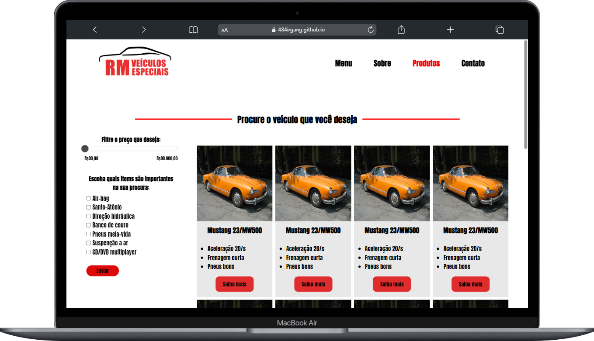
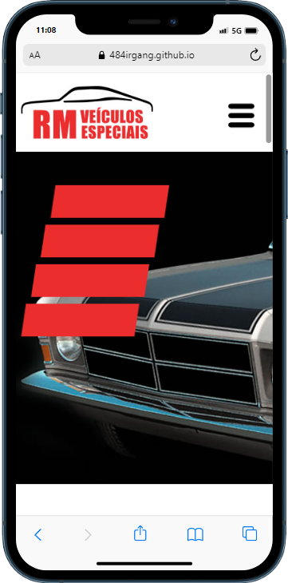

<h1> :beginner: Landing-page clone de uma revenda automotiva de carros antigos </h1>

<h1> :page_with_curl: Description</h1>

Projeto de landing-page da série de projetos Learning To Code, esse projeto foi feito através de exercicios de prática da plataforma Danki Code, desenvolvendo
do zero uma pagina estática e clone da plataforma, para treinar CSS e introduzir conceitos e funcionalidades com JQuery, em que foi inicialmente usado poucos trechos de código,
este projeto já foi finalizado em maio de 2022, atualmente foi feito pequenas alterções para poder subir no repositório mas sem anular o nivel de simplicidade e erros cometidos 
no projeto feito na epoca em que eu era mais iniciante. 

<h1> :camera: Images</h1>

<h3> :hammer: Technologies and Tools</h3>

  :heavy_check_mark:   HTML5 | 
     :heavy_check_mark:   CSS3 | 
     :heavy_check_mark:   JQUERY | 
     :heavy_check_mark:   JAVASCRIPT | 

<h3> :construction_worker: Author</h3>

   
  

